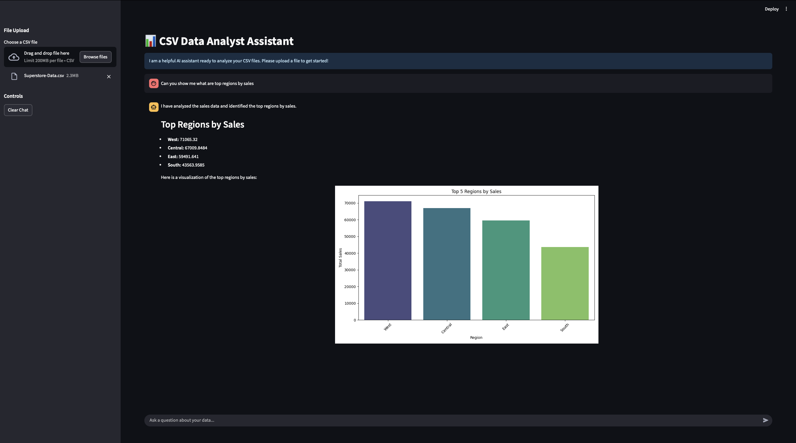
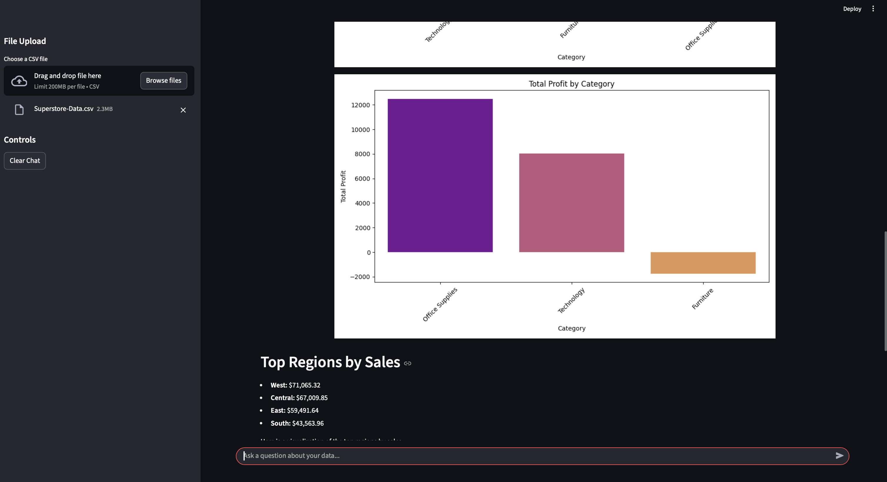
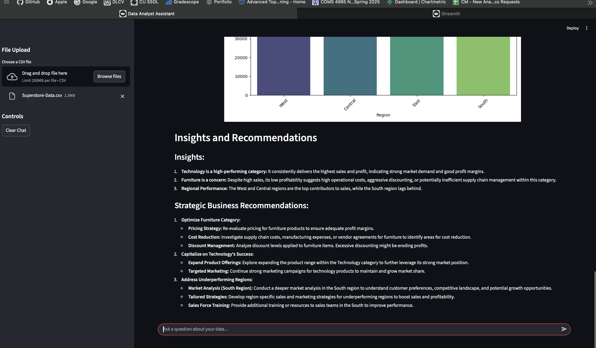
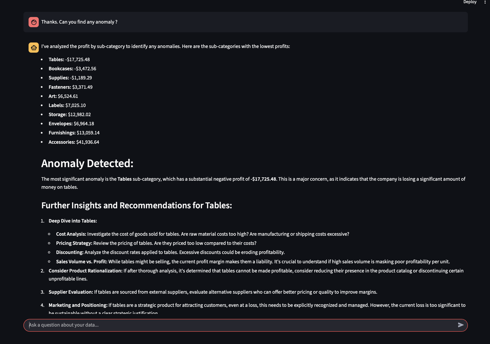

# Interactive Data Analytics Assistant using LLMs

An intelligent assistant that enables end-to-end data analytics on CSV datasets through conversational queries. Powered by **Google Gemini-2.5-Flash** and integrated with MCP-based tools, the assistant can perform statistical analysis, generate insights, and create visualizations on-demand.

---

## Features

- **Conversational Data Analysis**: Ask questions about your CSV files and get immediate insights, statistical summaries, and plots.
- **Dynamic Code Execution**: Uses Python, Pandas, NumPy, Matplotlib, and Seaborn to execute analysis tasks and generate visualizations.
- **Context Retention**: Maintains context across follow-up questions for smooth multi-turn interactions.
- **Tool Integration**: Integrates multiple MCP-based tools (`csv_analyzer`, `local_python_executor`) for robust and flexible data handling.

---

## Project Directory Structure

````
.
├── project-demo-images/      # Screenshots demonstrating the assistant
├── tools/
│   ├── csv\_tools.py          # Tool to analyze CSV files
│   └── local\_python\_executor.py  # Tool to execute Python code
├── app.py                    # Main streamlit application for interactive session through UI
├── client.py                 # Client interface for interactive session through cmd
├── requirements.txt          # Python dependencies
├── pyproject.toml            # Project metadata
└── README.md                 # Project documentation

````

---

## Demo Images

Here are some screenshots showing the assistant in action:






---

## Installation

1. Clone the repository:
```bash
git clone https://github.com/Dhruv-Limbani/Data-Analyst-Agent.git
cd <your-local-repo>
````

2. Create a virtual environment and activate it:

```bash
python -m venv venv
source venv/bin/activate   # Linux/macOS
venv\Scripts\activate      # Windows
```

3. Install dependencies:

```bash
pip install -r requirements.txt
```

4. Set up environment variables (if any) using `.env`.

---

## Usage

Run the interactive session:

```bash
streamlit run app.py
```

Type your queries about CSV files in the console. Examples:

* "Give me the top 3 categories by sales from Sales Data"
* "Show me a distribution of credit risk in Customer Credit Data"
* "Generate a visualization of sales by region"

Type `quit` to exit.

---

## Technologies Used

* **Python**
* **LangChain** & **LangGraph** for LLM orchestration
* **Google Gemini-2.5-Flash** for intelligent reasoning
* **Pandas, NumPy** for data manipulation
* **Matplotlib, Seaborn** for visualizations
* **Multi-Server MCP** for tool integration and dynamic code execution


## Contact

Created by **Dhruv Limbani**
[GitHub](https://github.com/Dhruv-Limbani) | [LinkedIn](https://www.linkedin.com/in/dhruvlimbani)

